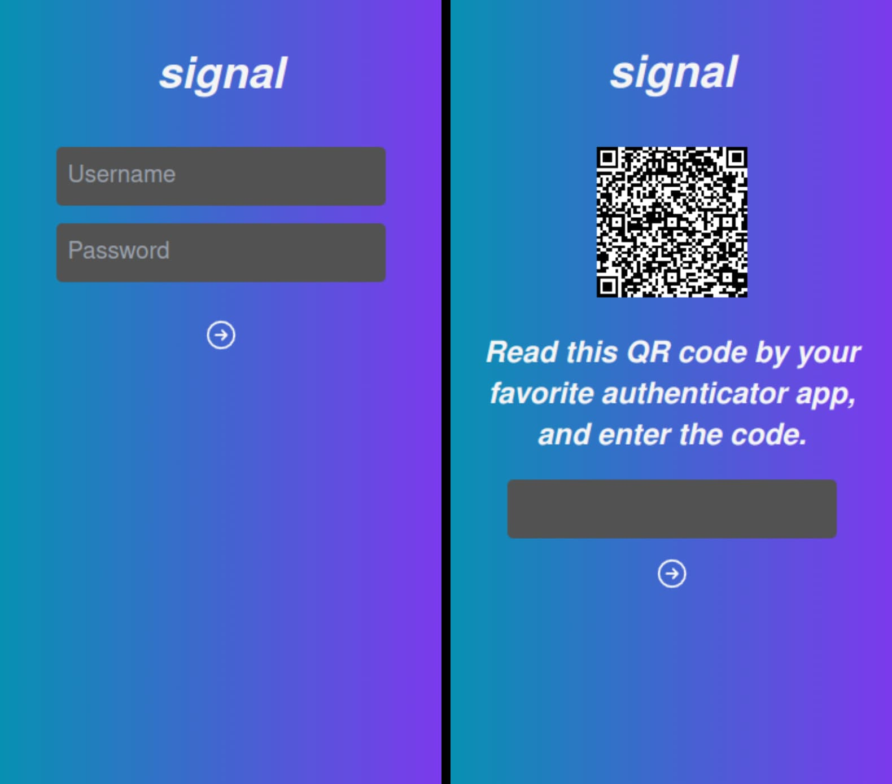
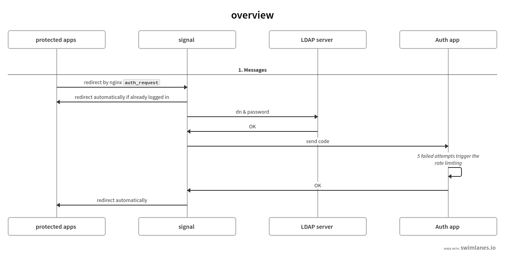

# signal



Simple 2fA authentication server.

- 1st step: LDAP authentication
- 2nd step: TOTP authentication
  - TOTP auth has the rate limiting feature: After 5 failed attempts in a minute, the client will have to wait for the next login attempt.



## Prerequisites

- proxy server (In this document, nginx is used)
- LDAP server
- mobile app for TOTP authentcation, e.g. Google Authenticator

## Deploy

**_Assume that `signal` is hosted in `signal.domain.com` and the other apps in `app.domain.com`._**

1. Create empty directory where login data is stored.

```
mkdir data
```

2. Deploy signal itself by `docker-compose.yml`.

```
version: "3"
services:
 signal:
   image: docker.io/kyoheiudev/signal
   container_name: signal
   volumes:
     - "/path/to/data:/app/data:rw"
   # if you need it
   network_mode: ldap_network_name
   environment:
     # LDAP server url
     - SIGNAL_LDAP_URL=ldap://localhost:3890
     # your domain
     - SIGNAL_DOMAIN=example.com
     # key to encrypt the totp secret
     - SIGNAL_SECRET=change_this
     # salt for the totp secret
     - SIGNAL_SALT=and_this
     # key to sign JWT
     - SIGNAL_JWT_SECRET=this_too
   ports:
     - 3000:3000
   logging:
     driver: json-file
     options:
       max-size: 1m
       max-file: "3"

```

3. Set your reverse proxy properly.

   ```
   # e.g. nginx auth_request setting
   # 127.0.0.1:8080 -> backend server
   # 127.0.0.1:9090 -> signal
   server_name  app.domain.com; # backend server URL

   location / {
       auth_request .auth;
       error_page 500 @auth_failed;
       proxy_pass http://127.0.0.1:8080;
   }

   location .auth {
       internal;
       proxy_pass http://127.0.0.1:9090/api/auth;
       proxy_pass_request_body off;
       proxy_pass_header Set-Cookie;
   }

   location @auth_failed {
       # Add ref param to redirect after logging in
       return 302 https://signal.domain.com?ref=$scheme://$http_host$request_uri;
   }
   ```
